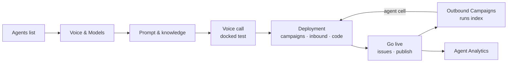

# Agent builder v3 in the live Console · KPI, journey, scenarios

Track **v3** (re-home what the live Console does, no new capability) · 2026-09-24 · ClickUp 868m0mf2u (18 · Channels)

The live Console's agent page splits one agent across four top tabs (Prompt · Models · Advanced · Actions) and a
three-tab side rail (Test · Code · Deploy). v3 turns it into the Studio X 2 builder: one page, a left section rail
(CUSTOMIZE: Voice & Models, Deployment, Prompt & knowledge · SHIP: Test, Go live), sections stacked and open, and
the agent's campaigns, inbound numbers and code on the same page as its prompt. It is built in the Console's own
design system; the visual revamp is a separate exercise.

Sources: `docs/strategy/agent-builder-kpis.md` (KPI tree, 2026-09-15), `LEARNINGS.md` §20 (locks),
`merger-v3/01-jtbd.md` (merger JTBD), ng-console `docs/observability/tracking-plan.md` (schema 2.1.0),
the build's decision record (`ng-console/docs/adr/0017-agent-builder-section-rail.md`) and the UX spec
(`ng-console/docs/design/agent-builder-ux.md`).

## 1. KPI: what this change may claim

| Level | Metric | Definition (short) | Target | Measurable in the Console today? |
| --- | --- | --- | --- | --- |
| North star | **Fast-Proven Rate** | Agents created in a week that hear a verified first answer within 15 min of active builder time and hold a proven conversation within 14 days, divided by agents created | ≥ 45 % | No: there is no test-session event yet (W0) |
| Input i1 | **TTFA** | Active time from opening the builder to the first verified answer, median and p75 | median ≤ 3 min | No (W0) |
| Input i2 | **Verified Test Rate** | New agents that reach a verified first answer within 14 days | ≥ 70 % | No (W0) |
| Input i3 | **Same-Block Deploy Rate** | Agents with a verified answer that publish and take a first production call within 24 h | ≥ 40 % | Partly: `operation_*` wraps agent publish, number binding and campaign create/publish |
| Guardrail | **First-publish failure rate** | `operation_failed` on the first `agent_publish`, by `errorStage` | ≤ 5 % | Yes, once `errorStage` is filled for this operation |
| Guardrail | **Evidence before live** | First publishes preceded by a verified test | ≥ 85 % | No (W0) |

**What v3 is built to move, and how we will know without new events.** The tracking plan forbids speculative
`journey_*` events, so v3 adds none. Its claims are structural and are checked in moderated sessions (two per role,
per the merger audit):

| Structural claim | Before (tabs) | After (builder) | Session check |
| --- | --- | --- | --- |
| Where this agent answers and calls from is visible on the agent | Deploy was a third-level tab; it never listed the agent's own numbers | Deployment shows its campaigns, the numbers that answer it and its code on the page | "Which numbers does this agent answer?" answered without leaving the page |
| Every setting has one home | Speech rows in Advanced, voice in Models, tools in Actions, prompt in Prompt | Five named sections, one Advanced settings sheet | Task "make it wait longer before answering" finds turn-taking in one try |
| Publishing says what blocks it | A disabled button or a toast after the fact | Go live lists issues, each with a door to the row | First-publish failure rate falls once `errorStage` is filled |
| Testing is one click from anywhere | Test tab always docked, costing the form width | "Voice call" in the header opens the docked panel | Watch i1 when W0 lands; a TTFA loss here reopens Q4 |

**Counter-metric.** The test panel is now closed by default. If W0 shows TTFA rising after v3, the panel goes
back to open by default at `lg` and wider. That is the one trade this redesign makes against the north star.

## 2. User journey: build, test, deploy, run, observe

| Stage | Persona job | Before: where it happened | After: where it happens |
| --- | --- | --- | --- |
| Arrive | Know what is already set | Prompt tab, no sign of the rest | Rail with grey ticks on what is configured |
| Voice & models | Choose the stack and the voice | Models tab | Voice & Models: architecture, models (voice inside TTS), Advanced settings sheet |
| Speech behaviour | Tune turn-taking, fillers, silence | Advanced tab, a separate page | Advanced settings sheet, opened from Voice & Models or from Opening "Change" |
| Prompt | Write what the agent says | Prompt tab | Prompt & knowledge: system prompt, opening, failure message |
| Knowledge and tools | Attach sources and actions | Actions tab | Prompt & knowledge: knowledge base, tools |
| Test | Hear it answer | Docked Test tab | Header "Voice call" or rail Test opens the docked panel |
| Deploy | Put it on traffic | Deploy and Code tabs in the side rail | Deployment: Outbound campaigns, Inbound, Code / SDK |
| Go live | Publish safely | Toolbar Publish, History icon | Go live: status, issues with fix doors, Review & publish, Version history, project facts, data retention |
| Run | Watch and stop a campaign | Outbound Campaigns | Unchanged; every run names its agent and opens its Deployment |
| Observe | Check quality | Agent Analytics | Unchanged |

## 3. Happy scenario (the hero journey)

*"Our support agent is live. I want it to answer our main number and call last week's missed callers."*

1. Agents › Support Voice Agent. The builder opens at the top; the rail shows Voice & Models, Prompt & knowledge and
   Go live ticked, Deployment not.
2. Voice & Models: the voice is inside the TTS row; Advanced settings › turn-taking set to Patient.
3. Prompt & knowledge: edit the greeting; "Callers hear" reads the new line.
4. Header "Voice call": the test panel docks on the right; Start Call; hear the new greeting; hang up.
5. Deployment › Inbound: "No number answers this agent yet." › Answer inbound calls opens Phone Numbers with the agent
   preselected.
6. Deployment › Outbound campaigns: Make outbound calls opens the campaign form with the agent preselected.
7. Rail footer "Unpublished changes" › Review & publish › Go live lists nothing blocking › publish.
8. Outbound Campaigns: the new run names the agent; its link opens Deployment with the campaign in view.

## 4. Rainy scenarios and the designed answer

| # | Situation | What the builder does |
| --- | --- | --- |
| r1 | The agent was never published | Deployment shows "Publish this agent before configuring telephony deployment." and no doors |
| r2 | Live, but the telephony record lags the publish | "Telephony deployment is still syncing. Refresh in a moment." Never "publish first" beside LIVE |
| r3 | The project has no phone number | Outbound campaigns offers "Add phone number" instead of "Make outbound calls" |
| r4 | No campaigns yet | "No campaigns yet. Make outbound calls to start one." |
| r5 | More than five campaigns | Five rows and "View all campaigns", filtered to this agent |
| r6 | No number answers this agent | "No number answers this agent yet." with "Answer inbound calls" |
| r7 | The deployed-agents lookup fails | Names render as text; no doors; no page error |
| r8 | Publish is blocked (no system prompt, missing model credentials) | Go live lists each issue with a door to the row; the Voice call panel shows the same issue instead of doing nothing |
| r9 | The agent is locked to custom config | The rail is hidden and the JSON editor owns the page, as today |
| r10 | Realtime (MLLM) agent | Voice & Models shows the realtime summary; the sheet shows realtime turn detection; knowledge shows the MCP-only notice |
| r11 | A call is running | Sections and rail are inert; the panel stays live so Hang Up works |
| r12 | Old bookmark `?tab=advanced`, `?rail=deploy`, `?tab=actions` | Resolves to the Advanced sheet, Deployment, Prompt & knowledge |
| r13 | Autosave fails | Toolbar "Save failed" with Retry, unchanged |
| r14 | Narrow window | The rail becomes a horizontal row above the sections; the panel stacks below |
| r15 | Many numbers on a big project | The inbound list reads the first 100 numbers and caps at five; "View all phone numbers" opens the inventory |

## 5. Before and after

| | Before (live Console) | After (v3 builder) | Why |
| --- | --- | --- | --- |
| Navigation | 4 top tabs + 3 rail tabs | 5-section rail, one scroll | One agent reads as one thing; ticks say what is set |
| Deploy | Two buttons in a side tab; the agent's numbers never listed | Three channel rows with their own state | The merger model: the run and the number belong to the agent |
| Speech settings | Advanced page | One sheet with anchors | Depth tracks how rare a decision is |
| Publish | Button + toast | Go live issues with fix doors | Say what blocks it, where to fix it |
| History | Icon in the toolbar | Version history in Go live | One door, next to publishing |
| Test | Always docked | Voice call opens it | The form gets the width; watch TTFA (§1) |

## 6. Parked for v3.1

One-choice deployment radio (lock 2026-07-29, needs a backend field) · edited-section count, Discard edits, Undo to
live · Run test scenarios and scorecards · Launch batch calls from the header · contact list on the agent · model-stack
slider with price · hosting region, web widget, WhatsApp and SMS · pause and resume · version pinned to a run ·
cost estimate · variable-versus-column check.
